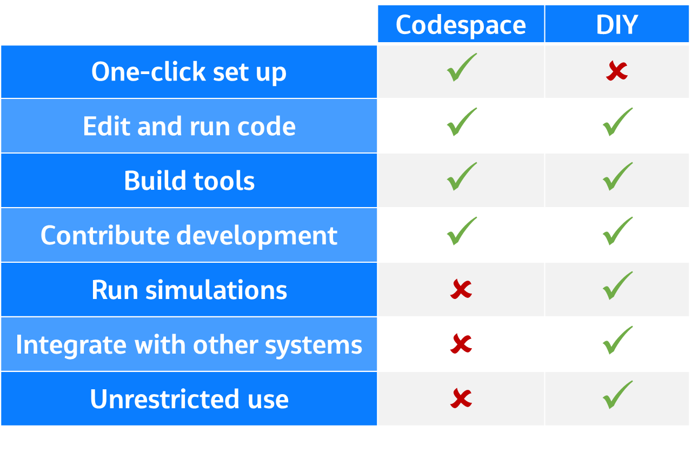

Getting Started
=====================================================
This section outlines how to get started with the Flood Modeller Python API from installation and importing, to a general
overview of the package.

.. note::

   The Flood Modeller Python API is designed to provide additional functionality to `Flood Modeller <https://www.floodmodeller.com/>`_, and to 
   realise the benefits of the API it is important to get the latest version of Flood Modeller and a valid `licence <https://www.floodmodeller.com/pricing>`_.

GitHub Codespace
-----------------

The quickest and simplest way to get started using the API is to use our GitHub Codespace. This is essentially
a web based environment with everything set up so you can start using the API in minutes. 

To access the Codespace:

1. Go to `github.com <https://www.github.com>`_ and create a new account if you don't have one 
2. Go to the 'floodmodeller-api' repository by either searching or use the link: `floodmodeller-api <https://www.github.com/People-Places-Solutions/floodmodeller-api>`_
3. Click the button to open in codespaces: 

4. Leave the settings as they are and click create codespace:
5. Allow a minute for the codespace to start up
6. Navigate to demo/readme.md and explore the getting started notebooks

The Codespace is great to very quickly try out the API and start using it, however there are some
limitations to the Codespace and once you have become more familiar with the API you may benefit 
from setting up your own python environment. For example in the Codespace you are not able to
access your Flood Modeller licence and run simulations.

An overview of the Codespace compared with a full installation is shown below:

.. toctree::
   :maxdepth: 2
   
   installation
   licensing
   overview

