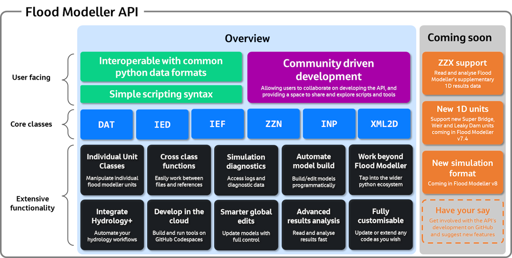

*************
API Overview
*************

|

Since the Flood Modeller API is a Python package, it is important that you are familiar 
with the basic concepts of Python as a programming language, particularly working with 
class objects. It is not necessary to be very experienced with Python, but having a grasp
of the fundamentals will allow you to get the most out of the API. 

The API is based around several main classes, which represent key Flood Modeller file formats: 
**DAT, IEF, IED, XML2D, INP** and **ZZN**. Each of these classes allow you to interact with the respective 
Flood Modeller file formats, by simply constructing a new class object pointing to the 
filepath of the file. For example, to create a new instance of a DAT class based on an 
existing dat file, you would call:

.. code:: python

   dat = DAT('path/to/datafile.dat')

This would then store a new object in the variable ``dat``, based on the ``DAT()`` class. 
From here, you can then work with the data using the class attributes and methods.

In addition to the main classes, there are also :doc:`individual unit classes <../user_guide/units>` 
which are used to work with key Flood Modeller unit types (e.g. QTBDY, River Sections etc.).
There is also a range of :doc:`additional functionality <../user_guide/additional_functionality>`
in the API such as difference and equivalence methods and automatic file backups.

This documentation provides information on the main API classes, including basic examples 
for each, plus the attributes associated with each supported unit class.

.. tip::
   The aim of the Flood Modeller API is not to provide any standalone tools for certain 
   tasks (many of these are likely covered in the main software itself), but instead to 
   give you the ability to work with Flood Modeller files in a way that can be easily built 
   into your own automated workflows. Combined with the thousands of openly available Python 
   packages, the possible use cases are truly endless.

.. note::
   The Flood Modeller API is an ongoing development and as such there are many features 
   which are not currently supported but may become available in future versions. For 
   additional technical support, feature suggestions or bug reports please `check out
   the GitHub site <https://github.com/People-Places-Solutions/floodmodeller-api>`_ or contact 
   support@floodmodeller.com
