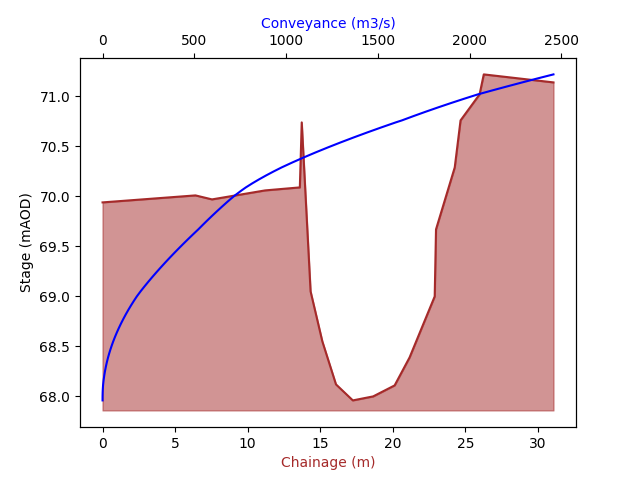

DAT Class
=====================================================
Summary
--------
The ``DAT`` class is used to read, write and update Flood Modeller's dat file format. The class 
is initiated with the filepath of a DAT file (full path or a relative path) to load an existing 
network. Alternatively,a new dat file can be created in memory by simply calling ``DAT()`` without 
passing in a file path. 

.. ipython:: python
   
    from floodmodeller_api import DAT
    DAT("network.dat") # read dat from file path
    DAT() # create a new blank dat file in memory

Once you have initialised a DAT class, the various units can be accessed via the attributes:

-  ``.sections`` (see: :ref:`Section units <section_units>`)
-  ``.conduits`` (see: :ref:`Conduit units <conduit_units>`)
-  ``.structures`` (see: :ref:`Structure units <structure_units>`)
-  ``.boundaries`` (see: :ref:`Boundary units <boundary_units>`)
-  ``.losses`` (see: :ref:`Loss units <loss_units>`)

In each, the units are stored in a dictionary of unit names and unit classes. Only units 
which are supported in the API will be accesible via these attributes, all of which can be 
found in the :doc:`Individual Unit Classes <units>` section.

.. ipython:: python 

    dat = DAT("EX18.DAT")
    dat.sections
    dat.conduits
    dat.structures
    dat.boundaries
    dat.losses

Each individual unit class is somewhat unique in how they can be worked with in python, but generally 
most unit classes will have a ``.name``, ``.comment`` and ``.data`` attribute. 

For example, a ``RIVER`` unit class contains the full section data as a dataframe:

.. ipython:: python
        
    dat.sections["S3"].data # Accessing the section data for river section 'S3'

All other associated data can be accessed and edited for a ``RIVER`` unit class via class attributes, 
for example the 'distance to next section' can be accessed using the ``.dist_to_next`` attribute:

.. ipython:: python

    dat.sections["S3"].dist_to_next # print the distance to next section for river section 'S3'

    dat.sections["S3"].dist_to_next = 150.0 # Update the distance to next section to 150m

It is possible to call the ``dat.next()`` and ``dat.prev()`` methods on a unit of any class 
to find the next or previous units in the reach:

.. ipython:: python
    
    dat.next(dat.sections["S3"])

You can use ``dat.insert_unit()`` and ``dat.remove_unit()`` to insert or remove one unit at a time 
from the dat file.

.. code:: python
    
    unit_S6 = dat.sections["S6"]
    dat.remove_unit(unit_S6) # remove unit S6 from dat file
    dat.insert_unit(unit_S6, add_after = dat.sections["S5"]) # add unit back into dat file

    from floodmodeller_api.units import RIVER
    dat.insert_unit(RIVER(name="new_unit"), add_at=-1) # insert a blank river section at the end

To insert multiple units at once, use the ``dat.insert_units()`` method.

.. ipython::

   In [1]: from floodmodeller_api.units import RIVER
      ...: blank_dat = DAT() # create a blank DAT instance
      ...: blank_dat.sections # currently empty   
   
   In [1]: new_sections = [RIVER(name=f"section_{i:>02}") for i in range(5)] # Create 5 new section units
      ...: blank_dat.insert_units(new_sections, add_at=-1) # insert all the units 
      ...: blank_dat.sections

Although it is possible to rename units by passing a new name into the ``.name`` attribute, 
it is recommended to avoid this as it may cause label issues within the network. 

For units that are not currently supported in the API, limited read-only access can be found
in the ``dat._unsupported`` attribute, where unit names, types and labels can be accessed.
The DAT representation of an unsupported unit can accessed but cannot be edited.

.. ipython:: python
    
    dat._unsupported
    print(dat._unsupported["P_suc (OCPUMP)"]) # printing a unit will show its DAT representation

In addition to the units, the general parameters for the DAT file can be accessed through 
the ``.general_parameters`` attribute. This contains a dictionary of all the general 
DAT settings and can be edited by assigning them new values. 

.. warning:: 
   Only change values in the general parameters which you are sure can be edited. For example, 
   'Node Count' should be treated as read-only

.. ipython:: python

    dat.general_parameters # Access dictionary of general DAT parameters

Conveyance curves
""""""""""""""""""

.. admonition:: *New in version 0.4.4*

   Calculated conveyance curves for river sections can now be accessed with the `.conveyance`
   attribute.

Calculating the conveyance curve of a river cross section can be useful when identifying 'spikes' in
the conveyance curve, or looking where panel markers may need to be added. The conveyance curve for 
a river unit can be accessed by simply calling ``.conveyance``. For example, to access the 
conveyance curve and plot it, you could do the following:

.. code:: python

    import matplotlib.pyplot as plt

    # Read in data
    dat = DAT("network.dat")
    section_data = dat.sections["CSRD10"].data
    conveyance_data = dat.sections["CSRD10"].conveyance

    def plot_section_with_conveyance(section_data, conveyance_data):
        # Set up matplotlib plot
        fig, ax1 = plt.subplots()

        ax1.plot(section_data.X, section_data.Y, "brown")
        ax1.fill_between(section_data.X, section_data.Y, section_data.Y.min() - 0.1, color="brown", alpha=0.5)
        ax1.set_xlabel("Chainage (m)", color="brown")
        ax1.set_ylabel("Stage (mAOD)")

        ax2 = ax1.twiny()
        ax2.plot(conveyance_data.values, conveyance_data.index, "b-")
        ax2.set_xlabel("Conveyance (m3/s)", color="b")

        # display it
        plt.show()

    # Plot with function
    plot_section_with_conveyance(section_data, conveyance_data)

In this example we see a spike in the conveyance at around 70.75mAOD, we can add a panel marker here 
and see how the conveyance curve is improved:

.. code:: python

    # Add a panel marker at the point in the section where there is a sharp peak
    section_data.loc[section_data.index[5], "Panel"] = True
    # recalculate conveyance curve
    conveyance_data = dat.sections["CSRD10"].conveyance

    # Plot with function
    plot_section_with_conveyance(section_data, conveyance_data)

Now we can see that the conveyance curve is improved! With a simple script this process of
identifying conveyance spikes and adding panel markers could be automated.

Rules and varrules
"""""""""""""""""""

Within a unit, there is also support for logical RULES & VARRULES. There is also support for VARIABLES 
in the DAT file as well.

.. warning:: 
    
    You can only use RULES, VARRULES & VARIABLES if your unit/file actually has them.

.. code:: python

    dat.structures["MINT_SLu"].rules
    >>> {
            {"name": "Rule 1", "logic": "IF (LEVEL(KENT06_036...mer=ON\nEND"},
            {"name": "Rule 2", "logic": "IF (Level(KENT06_036...ESTART\nEND"},
            {"name": "Rule 3", "logic": "IF (Level(KENT06_036...VE = 0\nEND"}
        }

    dat.structures["MINT_SLu"].varrules
    >>> {
            {"name": "Varrule 1", "logic": "IF (Level(KENT06_036....RESET\nEND"},
            {"name": "Varrule 2", "logic": "IF (Level(KENT06_036....RESET\nEND"}
        }

    dat.variables.data
    >>> {
            Index(["name", "type", "initial value", "initial status"], dtype="object")
            0: array(["TravelTimer", "TIMER", "0", "0"], dtype=object)
            1: array(["DumVar", "integer", "", "n/a"], dtype=object)
        }
        
Reference
--------------
.. autoclass:: floodmodeller_api.DAT
    
   .. automethod:: update

   .. automethod:: save
    
   .. automethod:: insert_unit
    
   .. automethod:: insert_units

   .. automethod:: remove_unit

   .. automethod:: diff

   .. automethod:: next

   .. automethod:: prev

   .. automethod:: to_json

   .. automethod:: from_json
      

Examples
-----------
**Example 1 - Adding 300mm siltation to all river sections** 

In this example, the cross section data for individual river sections needs to be edited to add 300mm to the lowest bed level and make this the minimum bed level across the 
entire section. This is a simple method to quickly represent siltation in the channel. The updated DAT file is saved to a new location rather than updating the original file.

.. code:: python

    # Import modules
    from floodmodeller_api import DAT

    # Initialise DAT class
    dat = DAT("path/to/datafile.dat")

    # Iterate through all river sections
    for name, section in dat.sections.items():
        df = section.data # get section data
        min_elevation = df["Y"].min() # Get minimum bed level across section
        raised_bed = min_elevation + 0.3 # Define new minimum bed level by adding 0.3m
        df["Y"].loc[df["Y"] < raised_bed] = raised_bed # Update any bed levels which are less than the new min bed level

    dat.save("path/to/datafile_300mm_siltation.dat") # Save to new location

**Example 2 - Inserting multiple units** 

In this example, multiple units from one DAT file are inserted into another DAT file.

.. code:: python

    # Import modules
    from floodmodeller_api import DAT

    # Initialise DAT class
    dat_1 = DAT("path/to/datafile1.dat")
    dat_2 = DAT("path/to/datafile2.dat")

    # Insert units from dat_2 into dat_1
    dat_1.insert_units(
        units=[dat_2.sections["20"], dat_2.sections["30"]],
        add_before=dat_1.sections["P4000"],
    )

    dat_1.save("path/to/new_datfile1.dat") # Save to new location
