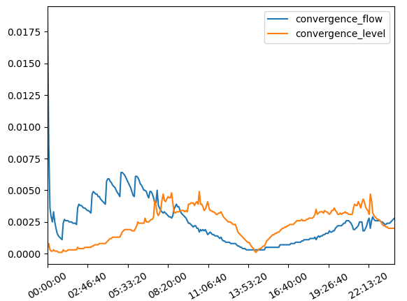

***********
LF Classes
***********
Summary
--------
The ``LF1`` and ``LF2`` classes allow for rapid reading of Flood Modeller's log file format for 1D (.lf1) and 2D (.lf2) simulations. The class must be intiated with the full filepath to a given log file:

.. code:: python

    from floodmodeller_api import LF1, LF2

    lf1 = LF1('path/to/log.lf1')
    lf2 = LF2('path/to/log.lf2')

Both the ``LF1`` and ``LF2`` classes are used in the same way.

.. warning:: 
   Log files will not always be present if simulations are run through the Flood Modeller 
   UI but should be present if run via the API.

.. note::
    As well as reading the log files directly using the LF1 or LF2 classes, you can also get
    the log for a simulation directly using the :py:meth:`floodmodeller_api.IEF.get_log` method.

Reference
--------------
``LF1``
~~~~~~~
.. autoclass:: floodmodeller_api.LF1
    
   .. automethod:: to_dataframe

   .. automethod:: read

   .. automethod:: report_progress

``LF2``
~~~~~~~
.. autoclass:: floodmodeller_api.LF2
    
   .. automethod:: to_dataframe

   .. automethod:: read

   .. automethod:: report_progress

Examples
-----------
**Example 1 - Reading log file and exporting to dataframe**

The ``LF1`` class can be used to read a .lf1 file and return the changing parameters as a dataframe.

.. code:: python

    from floodmodeller_api import LF1

    lf1 = LF1("..\\sample_code\\sample_data\\ex3.lf1")

    print(lf1.to_dataframe())

This prints the following pandas dataframe object:

.. code:: python

                     mass_error               timestep         elapsed  iter  log(dt)  convergence_flow  convergence_level  inflow  outflow
    simulated
    0 days 00:00:00        0.00 0 days 00:00:18.750000 0 days 00:00:00   6.0      4.6            0.0186             0.0004    3.67     2.58
    0 days 00:05:00       -0.01 0 days 00:00:37.500000 0 days 00:00:00   5.0      6.2            0.0086             0.0008    3.71     2.69
    0 days 00:10:00       -0.04 0 days 00:00:37.500000 0 days 00:00:00   3.0      6.2            0.0036             0.0003    3.75     3.04
    0 days 00:15:00       -0.05        0 days 00:01:15 0 days 00:00:00   3.0      7.8            0.0029             0.0002    3.79     3.32
    0 days 00:20:00       -0.07        0 days 00:02:30 0 days 00:00:00   3.0      9.4            0.0025             0.0002    3.83     3.50
    ...                     ...                    ...             ...   ...      ...               ...                ...     ...      ...
    0 days 23:45:00       -0.04        0 days 00:05:00 0 days 00:00:01   3.0     11.0            0.0025             0.0020   21.30    23.45
    0 days 23:50:00       -0.04        0 days 00:05:00 0 days 00:00:01   3.0     11.0            0.0026             0.0020   20.55    22.65
    0 days 23:55:00       -0.03        0 days 00:05:00 0 days 00:00:01   3.0     11.0            0.0027             0.0020   19.79    21.86
    1 days 00:00:00       -0.03        0 days 00:05:00 0 days 00:00:01   3.0     11.0            0.0028             0.0020   19.04    21.06

**Example 2 - Reading log file and printing dictionary**

The ``LF1`` class can also be used to directly access the fixed data stored within the .lf1 file, using the ``info`` dictionary.

.. code:: python

    from floodmodeller_api import LF1

    lf1 = LF1("..\\sample_code\\sample_data\\ex3.lf1")

    print(lf1.info)

This prints the following dictionary:

.. code:: python

    {
        'version': '5.0.0.7752',
        'qtol': 0.01,
        'htol': 0.01,
        'start_time': datetime.timedelta(0),
        'end_time': datetime.timedelta(days=1),
        'ran_at': datetime.datetime(2021, 9, 8, 12, 18, 21),
        'max_itr': 11.0,
        'min_itr': 3.0,
        'progress': 100.0,
        'EFT': datetime.time(12, 18, 24),
        'ETR': datetime.timedelta(0),
        'simulation_time_elapsed': datetime.timedelta(seconds=3),
        'number_of_unconverged_timesteps': 0.0,
        'proporion_of_simulation_unconverged': 0.0,
        'mass_balance_calculated_every': datetime.timedelta(seconds=300),
        'initial_volume': 39596.8,
        'final_volume': 53229.4,
        'total_lat_link_outflow': 0.0,
        'max_system_volume': 270549.0,
        'max_volume_increase': 230952.0,
        'max_boundary_inflow': 129.956,
        'max_boundary_outflow': 127.874,
        'net_volume_increase': 13632.6,
        'net_inflow_volume': 13709.5,
        'volume_discrepancy': 76.8984,
        'mass_balance_error': -0.03,
        'mass_balance_error_2': -0.0
    }

**Example 3 - Plotting convergence**

The dataframe attributes of ``LF1`` can be easily plotted.

.. code:: python

    from floodmodeller_api import LF1
    import matplotlib.pyplot as plt

    lf1 = LF1("..\\sample_code\\sample_data\\ex3.lf1")

    lf.convergence.plot()
    plt.savefig("convergence.png")

**Example 4 - Reading TUFLOW HPC**

The ``LF1`` class also includes information from linked TUFLOW HPC models.
This will be included in the ``info`` attribute automatically, and can be included in the dataframe via the ``include_tuflow`` argument.

.. code:: python

    from floodmodeller_api import LF1

    lf1 = LF1("path/to/log.lf1")

    print(lf1.to_dataframe(include_tuflow=True))
    print(lf1.info)
